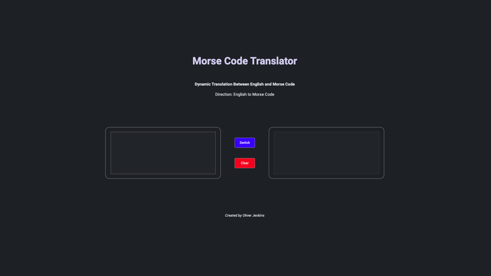

# Morse Code Translator

## Project Overview
This project is a Morse Code Translator web page, designed to convert English to Morse Code and vice versa in a simple, user-friendly interface.

## Deployment Link
This translator app is live! Check it out [here](https://morse-code-translator-project.netlify.app/).

## Screenshot

## Table of Contents
- [Goals & MVP](#goals--MVP)
- [Tech Stack](#tech-stack)
- [Build Steps](#build-steps)
- [Design Goals](#design-goals)
- [Project Features](#project-features)
- [Additions & Improvements](#additions--improvements)
- [Learning Highlights](#learning-highlights)
- [Known Issues](#known-issues)
- [Challenges](#challenges)

## Goals
Create a minimalist yet fully functional Morse Code translator as an MVP, with scope for adding more interactive features once the basics are solidly in place.

## Tech Stack
- HTML
- CSS/SCSS
- JavaScript
- Git
- Jest Testing

## How to Use
Simply enter English text or Morse Code into the input field and press the translate button to see the conversion in real time.

## Design Goals
- Decisions about project design

## Project Features
- [x] Basic translation functionality between English and Morse Code
- [x] Clean, distraction-free interface focusing on usability
- [x] Efficient translation algorithms with proper handling of spaces and special characters

## Additions & Improvements
- [ ] Simplify the translation logic for maintainability.
- [ ] Implement colorful placeholder texts that change when the translation direction switches
- [ ] Add a Morse Code chart for user reference and improve mobile responsiveness
- [ ] Enhance Morse to English translation visibility and user feedback
- [ ] Addition of project testing and github workflow badges

## Learning Highlights
- Gained valuable experience in JavaScript application development, UI design principles, and automated testing with Jest.

## Change Logs
List of dates and work provided

## Known Issues
- Current bug in handling backspace which affects continuous text editing

## Challenges
- List challenges

## Contact Me
- Visit my [LinkedIn](https://www.linkedin.com/in/obj809/) for more details.
- Check out my [GitHub](https://github.com/cyberforge1) for more projects.
- Or send me an email at obj809@gmail.com
 
Thanks for your interest in this project. Feel free to reach out with any thoughts or questions.
 
 
Oliver Jenkins © 2024
