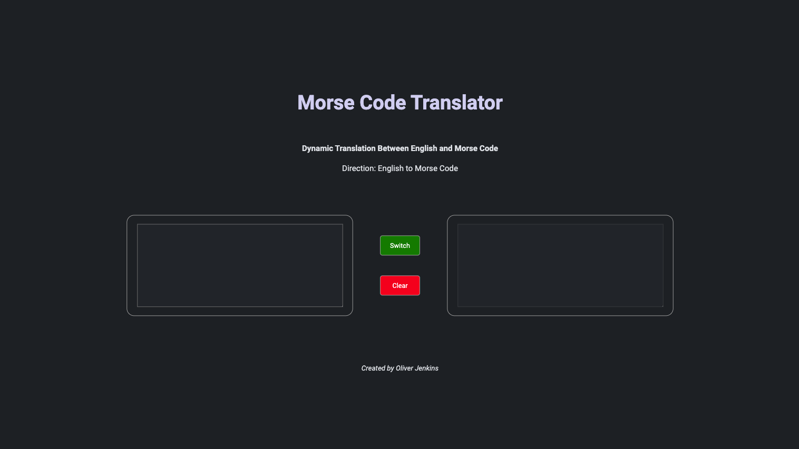

# MORSE CODE TRANSLATOR

## Project Overview & Link

In this project, I will create a morse-code translator where the user will be able to input either morse code or English into a dialogue box and have it be translated into the other.

## Table Of Contents
- GOALS
- HOW TO USE
- TECH STACK
- IMPLEMENTATION
- CODE FUNCTION & DESIGN DECISIONS
- ISSUES & BUGS
- ADDITIONS AND IMPROVEMENTS

## Screenshot

## Goals

- To iterate through JS Object data types by using methods such as Object.keys(), Object.values() and Object.entries

- To use modular code, paired with import and export statements, to separate logic and DOM manipulation functions. 

- To gain more experience with DOM traversal and dynamically generating HTML with Javascript 

- To write Unit Testing for testing of the application logic using JEST

- To provide the user a simple and functional UI 

- To make the translation into morse code instantaneous 

## How To Use / Important Elements & Functions

The user will be able place English text into the left dialogue box and have it translate immediately to morse code in the right hand dialogue box.

By selecting the button in between the two dialogue boxes will toggle between English -> Morse Code and Morse Code -> English

The user will be able to place morse code letters into the right dialogue box and have it translate immediately to English in the left hand dialogue box.

## Tech Stack
    - HTML
    - CSS
    - JavaScript
    - JEST
    - Git 

## Implementation

### MVP (Basic Requirements)
- basic user interface to input and submit text
- translation of English text to morse code and vice versa
    
### UI

### LOGIC 

## Build Plan

1) Creation of the basic English to Morse Code logic functions

2) Creation of a simple HTML & CSS interface

3) Adding function to this interface with a DOM manipulation

4) Separation into modules and Dom-utils scripts

5) Creation of the Morse code to English logic function and optimization of matching

6) Replacement of standard HTML interface with a dynamically generated UI

## Code

## Issues / Bugs

## Potential Additions

Addition of a two way translation via placing morse code in the right dialogue box and having it translated to English on the left hand side

Addition of input numbers into the morse code translator object.

